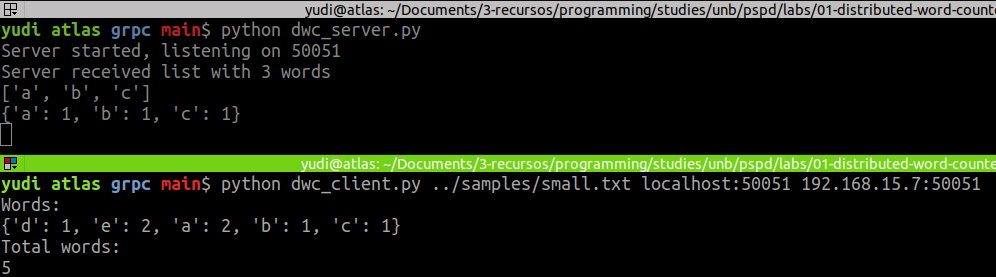
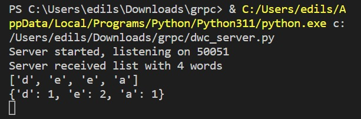

# Implementações

O nome do programa de maneira geral é Distributed Word Counter (DWC). 

## RPC 1 worker
Foi implementado uma versão muito simples em que o cliente envia uma lista de 
palavras hard coded para um servidor. 

O restante seria fazer o servidor retornar como resposta uma estrutura semelhante
a um dicionário com a frequência de cada palvrava. Parecido com o que foi feito 
em **gRPC 2 Workers**.

Entre no diretório e compile o código:

```sh
cd a-rpc-1-worker
make
```

Em uma janela inicie o servidor:

```sh
./dwc_server
```

Em uma janela inicie o cliente:

```sh
./dwc_client
```

## RPC 2 workers
Não foi implementado.

## gRPC 2 workers

Esse módulo foi desenvolvido com Python 3.11, mas deve funcionar com qualquer
versão 3.6+. 

Entre na pasta e instale as dependências gRPC:

```sh
cd c-grpc/
pip install -r requirements.txt
```

Em uma janela de terminal inicie o servidor

```sh
python dwc_server.py
```

Em outra janela de terminal execute o cliente

```sh
python dwc_client.py ../samples/line.txt localhost:50051 localhost:50051
```

Nesse caso, o trabalho será dividido entre threads no mesmo host. O resultado 
deve ser algo assim:

```
Words:
{'d': 1, 'e': 2, 'a': 2, 'b': 1, 'c': 1}
Total words:
5
```

Ainda foi possível executar servidores em _hosts diferentes_. Nesse experimento,
o cliente e um servidor foram executados em uma máquina Linux e um segundo servidor
foi executado em uma máquina Windows. As Figuras \ref{fig:grpc-host-1} e
\ref{fig:grpc-host-2-server} ilustram os resultados do experimento.





Vale ressaltar que o cliente foi executado especificamente com os endereços do
host 1 e host 2.

O cliente leu do arquivo `line.txt` as plavras `a b c d e e a` e enviou a 
primeira metade para o servidor em Linux e a segunda metade para o servidor em 
Windows.

O servidor no Windows recebeu as palavras `d e e a` e calculou a frequência de 
palavras `{d: 1, e: 2, a: 1}`. O servidor em Linux, por sua vez recebeu as 
palavras `a b c` e calculou a frequência de palavras  `{a: 1, b: 1, c: 1}`. Esses
resultados foram devolvidos para o cliente que ficou responsável por juntá-los.
Em seguida ele imprimiu a junção das duas frequências de palvras: 
`{d: 1, e: 2, a: 2, b: 1, c: 1}`.

Você pode testar outros arquivos, basta fornecer o caminho relativo para eles 
no diretório `c-grpc/samples/`. Exemplo:

```sh
python dwc_client.py ../samples/raven.txt <host 1> <host 2>
```

### Possíveis melhorias

- Generalizar a quantidade workers. Na implementação atual, essa quantidade
deve ser obrigatoriamente igual a 2.
- Escolher número de workers pela linha de comando quando executar o cliente.

# Dificuldades

Por falta de tempo e um pouco de desorganização, não consegui realizar o 
exercício na versão RPC. A solução desenvolvida por mim exigia algumas estruturas
de dados relativamente complexas e não consegui encontrar uma representação 
funcional para o XDR. Encontrei alguns links na internet que esclareceram um 
pouco, mas não tive tempo hábil para explorá-los e implementá-los.

# Opinião geral

Achei o trabalho engajante e desafiador. São trabalhos assim que me cativam durante
o semestre. Espero mais laboratórios assim durante o semestre, mas de preferência
com prazo de entrega maior. Com certeza vou continuá-lo depois dessa entrega. 

**Minha nota** para partição e aprendizado: 8.

# Referências

Códigos exemplo:

- https://github.com/thiagohdaqw/pspd-RPC-Socket
- https://github.com/thiagohdaqw/gRPC-PSPD

Vídeos teóricos:

- https://www.youtube.com/watch?v=HbBxO5RXNhU
- https://www.youtube.com/watch?v=F4t3ZBVMlvo
- [RPC Vs Simple Procedure Call - Georgia Tech](https://www.youtube.com/watch?v=gr7oaiUsxSU)

<!-- 

Passing Complex Data Structures
https://docs.oracle.com/cd/E19683-01/816-1435/rpcgenpguide-6/index.html


https://sites.ualberta.ca/dept/chemeng/AIX-43/share/man/info/C/a_doc_lib/aixprggd/progcomc/rpc_arbdata_ex.htm

https://sites.ualberta.ca/dept/chemeng/AIX-43/share/man/info/C/a_doc_lib/libs/commtrf1/xdr_string.htm#A138X9e5b

https://sites.ualberta.ca/dept/chemeng/AIX-43/share/man/info/C/a_doc_lib/aixprggd/progcomc/xdr_ref.htm#A6gDFg190blai

Linked Lists:
https://www.ibm.com/docs/en/aix/7.1?topic=representation-passing-linked-lists-using-xdr-example
 -->