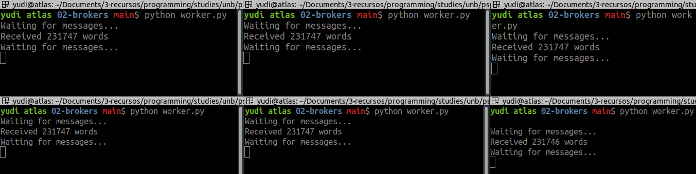
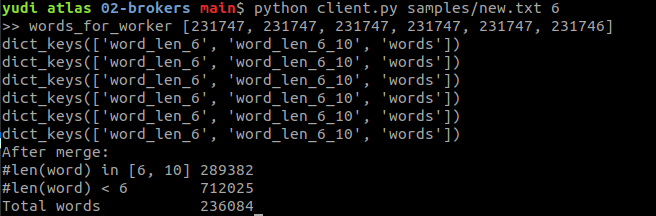

# Solução

A solução implementada divide o trabalho de maneira quase uniforme entre a 
quantidade de workers (6 no máximo). A quantidade de trabalho total é quantidade 
de palavras lidas pelo cliente.

Depois que o cliente determina a quantidade de trabalho para cada worker, ele 
envia os respectivos pedaços da lista de palavras para cada worker:

```py
# client.py
offset = 0
for words_job in words_for_workers:
    words_slice = words[offset:offset+words_job]
    word_count = client.call(words_slice)
    offset += words_job
    WordCountMerger.merge(word_count)
```

`word_count` é o dicionário com a frequência de palavras. A cada recebimento
dos workers, o cliente realiza a fusão da frequência de palavras em apenas
um `word_count`.

# Instalação

Certifique-se de estar no diretório do projeto. Se você executar `ll`, você
deve ver algo assim:

```sh
client.py
worker.py
requirements.txt
samples/
# outros arquivos
```

Para sua conveniência, alguns arquivos de testes estão em `samples/`.

Para instalar as bibliotecas necessárias execute:

```sh
pip install -r requirements.txt
```

Só tem a dependência `pika`, que é a implementação RabbitMQ do broker.

Para executar, você pode abrir seis janelas de terminais e executar
`python worker.py` em cada uma delas.

Em uma sétima janela de terminal execute `python client.py samples/new.txt 6`.

O que você deve ver nas janelas dos workers é algo semelhante ao da figura
\ref{fig:img-workers}.



No cliente você deve ver algo como na figura \ref{fig:img-client}.



Você pode observar que o cliente recebeu as seis mensagens de cada worker. No
final ele mostra o resultado da fusão de cada mensagem. O cálculo retornou:

- Total de palavras: 236084
- Palavras com menos de 6 caracteres: 712025
- Palavras mais de 6 e menos de 10 caracteres: 289382

# Opinião geral
Foi um trabalho legal, mas infelizmente não tive tempo pra me didicar a ele
como deveria inlcuindo mostrando a comparação dos desempenhos.

**Minha nota**: 7.

