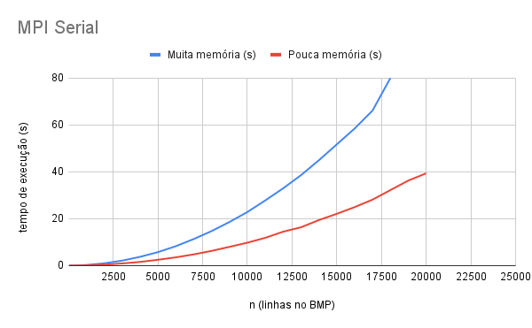
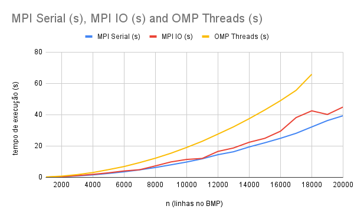
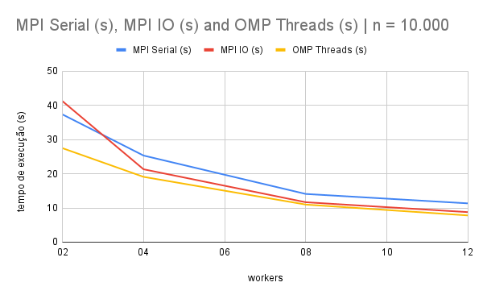

<!-- Esse é o mesmo texto do PDF -->

# Preparo do ambiente

Certifique-se de ter as seguintes dependências instaladas na sua
máquina:

- GCC
- Make
- OpenMPI
- MPI

Com as dependências instaladas, você pode compilar os programas executando
o seguinte:

    make
Note que os códigos fonte estão em `fractal/`. Se ocorreu tudo certo, deve haver
alguns executáveis: 

- `f`: programa original de gerar o fractal. Foi usado para gerar imagens
de referência para verificar  o funcionamento correto dos programas a seguir
- `fractalmpiserial`: programa desenvolvido no laboratório
- `fractalmpi_io`: programa desenvolvido no laboratório
- `fractalmpiserial-slow`: programa desenvolvido no laboratório versão mais lenta
- `fractalmpi_io-slow`: programa desenvolvido no laboratório versão mais lenta
- `fractalomp`: programa desenvolvido no laboratório
- `diff`: programa desenvolvido no laboratório para mostrar a diferença 
entre dois arquivos `.bmp`.

Para usar o `diff`, execute o seguinte:

    ./diff file1.bmp file2.bmp

# Execução e medição dos experimentos

<!-- Para cada ponto dos gráficos apresentados a seguir, o programa analisado foi 
executado no mínimo 10 vezes e o tempo final de execução é a média dos tempos
dessas execuções. -->

<!-- Além disso, -->
Para as implementações em MPI, a distribuição de _jobs_ foi 
determinada por uma distribuição _round robin_. Assim, os processos
possuem uma quantidade quase igual de jobs. A implementação da distribuição
de _jobs_ está no arquivo `job_division.h`.

Os experimentos a seguir foram executados no cluster da **chococino**.

# Experimentos

## Variando $n$, fixado 4 _workers_

Denota-se por $n$ o número de linhas do arquivo _bitmap_. Os valores de $n$
adotados estão no intervalo  dos inteiros:

$n \in \left[ 1 \cdot 10^3, 2 \cdot 10^3, ..., 19 \cdot 10^3, 20 \cdot 10^3\right]$

Para realizar uma comparação justa entre os prgramas MPI e OpenMPI, o número de
workers foi fixado em 4. Os 
programas que usam MPI disparam 4 processos nas máquinas cm1, cm2, cm3 e cm4, 
1 processo por máquina. Os programas que usam OpenMP disparam 4 _threads_.

Para as implementações em MPI, o tempo de execução foi medido pelo processo de
$rank$ 0.

### Fractal MPI Serial: duas estratégias

Para a versão do programa do fractal MPI serial foram comparadas
duas estratégias de alocação de memória. Na primeira estartégia, todos os 
processos alocam memória o suficiente para escrever o arquivo inteiro. Na
segunda estratégia, cada processo aloca memória o suficiente para
a sua operação, ou seja, uma fração do tamanho do arquivo inteiro. 
Assim, a primeira estratégia consome mais memória que a 
segunda.

Os seguintes comandos podem ser usados para executar os programas:

    mpirun -n 4 -host cm1,cm2,cm3,cm4 ./fractalmpiserial <n>
    
    mpirun -n 4 -host cm1,cm2,cm3,cm4 ./fractalmpiserial-slow <n>

A Figura \ref{fig:fig1} mostra a comparação
entre as duas estratégias. O eixo vertical representa o tempo de execução em 
segundos e o eixo horizontal representa o número de linhas do arquivo _bitmap_.
A primeira estratégia que usa mais memória
está em azul, enquanto que a segunda estratégia está em vermelho. Observando
a Figura \ref{fig:fig1} fica evidente que a segunda estratégia possui melhor
desempenho.

Para número de linhas igual ou superior a 19.000, o programa implementado
com a primeira estratégia falha por 
_segmentation fault_. É possível que para essas quantidades, o sistema operacional
não libere memória para a execução de todos os processos.

> Para os experimentos posteriores, para os programas MPI, foi usado a estratégia
> que usa menos memória.

### Fractal MPI Serial vs MPI IO vs OpenMP

A Figura \ref{fig:fig2} mostra a comparação de desempenho dos programas 
MPI serial, MPI IO e OMP threads.

Os programas MPI usam a função `MPI_File_write_at` para escrever em arquivo.

Surpreendentente a versão MPI IO é mais devagar que a MPI Serial. Isso é contra
intuitivo já que o programa MPI IO realiza a escrita em paralelo.

Realizando o experimento, pude observar que era criado um arquivo com nome
`out_julia_normal.bmp-<numero qualquer>.lock`. Pode ser que esse arquivo
sirva como controle para que diferentes processos não escrevam no mesmo 
arquivo na mesma parte. Isso é improvável já que cada arquivo escreve em porções
diferentes do arquivo.

## Variando _workers_, fixado $n$ em 10000

A quantidade de _workers_ foi de 2, 4, 8, 12.

O tempo de execução para os programas MPI foi considerado o maior tempo de execução
dos processos filhos.

### Fractal MPI Serial vs MPI IO vs OpenMP

Para gerar os dados, os programas foram executados assim:

    mpirun -n 12 -host cm1:3,cm2:3,cm3:3,cm4:3 ./<programa MPI> 10000

    mpirun -n 8 -host cm1:2,cm2:2,cm3:2,cm4:2 ./<programa MPI> 10000

    mpirun -n 4 -host cm1:1,cm2:1,cm3:1,cm4:1 ./<programa MPI> 10000

    mpirun -n 2 -host cm1:1,cm2:1 ./<programa MPI> 10000

Dessa maneira, a distribuição de processos ficou bem equilibrada entre os 
workers.

A Figura \ref{fig:fig3} apresenta os resultados deste experimento. Variando o 
número de workers, fica claro que a implementação com melhor desempenho é a 
OMP _Threads_.

<!-- 
Para uma determinada dimensão do referido fractal, qual dos três programas 
montados apresenta melhor performance? 

Qual o percentual de ganho de uma solução em relação a
outra? 

Para essa resposta, montar um experimento controlado, com simulações de execução
dos códigos, levando-se em conta os parâmetros que influenciam a resposta 
(número de threads, de núcleos, de máquinas, etc.). 

Ao final dos testes, monte uma tabela comparativa e
mostre ostempos de execução de cada programa, considerando os parâmetros que 
influenciam a performance e apresente uma resposta conclusiva.

-->

# Trabalhos futuros

- Implementar o programa MPI IO 2 que seja mais rápido que MPI IO original e
que o MPI Serial.
- Implementar `ordena_vetor` com OpenMP.